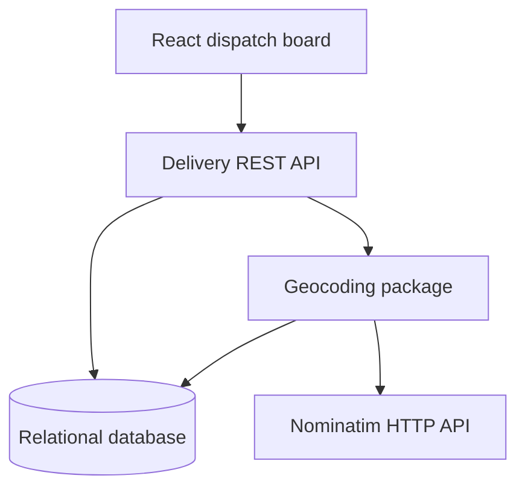

# Delivery Zone & Distance Estimator

Case B-002: geocode delivery addresses, calculate Haversine distance from a factory
in Jakarta, and assign shipping zones on a dispatch board.

**Stack:** Java 17 · Spring Boot 3.5.6 · React 19 / TypeScript · Vite 7 · PostgreSQL 16
· Flyway · Docker Compose. The user interface is in Indonesian.

## Start with one command

Install Docker Desktop with Docker Compose v2. From the repository root:

```bash
docker compose up
```

The first run builds images and downloads dependencies. Open **http://localhost:3000**
after all services are healthy. No API key is required.

| Service | Address |
| --- | --- |
| React board | http://localhost:3000 |
| Delivery API | http://localhost:8080/api/deliveries |
| Health check | http://localhost:8080/actuator/health |
| PostgreSQL | localhost:5432; database `delivery_zone`; user `delivery`; password `delivery_dev` |

Compose waits for PostgreSQL health, starts Spring Boot, then React/Nginx. Flyway
creates the tables. The frontend proxies `/api` to Spring Boot, avoiding CORS setup.
Use `docker compose up --build` after source changes. `docker compose down` stops
services while retaining the named database volume and cached coordinates.

Copy `.env.example` to `.env` only to override ports, credentials or provider settings.
Development credentials are local defaults. No auth or deployment is included.

## Nominatim usage

**Read the [Nominatim usage policy](https://operations.osmfoundation.org/policies/nominatim/)
before calling the public endpoint.** This application uses the provider explicitly
specified in the assessment. Public Nominatim permits light interactive usage with
a maximum of one request per second, an identifiable User-Agent, attribution and
cached results. Autocomplete and systematic querying are not allowed. Do not submit
personal or confidential data; use public landmarks for this demonstration.

The application sends a descriptive `GEOCODING_USER_AGENT`, caches successful results,
serializes outbound requests with a minimum 1.1-second interval after the previous
request finishes, and shows attribution in the UI. Lookups happen on form submission
or explicit retry, never while typing. Replace the demo User-Agent with your own
application identity and repository/contact before external use. Use a suitable
hosted/self-hosted provider for larger use; `GEOCODING_BASE_URL` is configurable.
Automated tests use mocks and a local HTTP stub, never the public service.

## Implemented requirements

| Priority | Requirement | Implementation |
| --- | --- | --- |
| P0 | Create/list, validation, 404 | REST API, Bean Validation, JSON errors |
| P0 | Open API geocoding | Nominatim HTTP adapter |
| P0 | Database cache | Unique normalized address, coordinates and fetch time |
| P0 | Haversine and zones | Own calculation, exact boundaries before rounding |
| P0 | React board | List/create form, loading/empty/success/error states |
| P0 | Provider outage | Cache-first resolution or persist UNKNOWN |
| P1 | Docker Compose | Full stack: database, backend and frontend |
| P1 | Update/delete | Edit form and delete confirmation |
| P1 | Zone/status filters | Server-side filters combined with AND |
| P1 | Coordinate metadata | Expandable details next to each zone badge |
| P2 | Additional feature | Explicit retry for unresolved deliveries |
| P2 | Cost/ETA | Illustrative per-zone estimate |
| P2 | Tests | Distance, boundaries, cache, fallback, concurrency and REST |
| P2 | Rate limit/User-Agent | Global limiter for one application instance |

This is the expected **modular monolith**. The optional separate geocoding
microservice is not implemented; the extraction path is explained below.

## Rules and assumptions

Factory: **latitude -6.1751, longitude 106.8650**.

| Zone | Haversine distance | Illustrative cost / shipment | Illustrative ETA |
| --- | --- | --- | --- |
| LOCAL | Less than 50 km | IDR 25,000 | 1 day |
| REGIONAL | 50–300 km, including both boundaries | IDR 75,000 | 2–3 days |
| LONG_HAUL | Greater than 300 km | IDR 150,000 | 4–7 days |
| UNKNOWN | Coordinates unavailable | No estimate | No estimate |

The brief supplies no rates/SLA: prices and ETAs are **demonstration assumptions**,
not carrier quotes. They ignore weight, traffic, ferries, weekends and cut-off times.
Distance is a straight-line great-circle estimate, **not a road route**. Earth radius
is 6,371.0088 km. Coordinates use six decimal places, distance uses two. Zone is
classified on unrounded distance calculated from those coordinates: 49.999 remains
LOCAL even when displayed as 50.00; 300.001 remains LONG_HAUL.

Statuses: PLANNED, IN_TRANSIT, DELIVERED, CANCELLED. Transitions are unrestricted.
Omitted/null status defaults to PLANNED on create and preserves status on update.
Order reference is required, maximum 50 characters; it is not unique because an
order may have multiple deliveries. Address is required, maximum 300 characters.

## Cache and failure handling

1. Trim outer whitespace, collapse internal whitespace and lowercase with
   `Locale.ROOT`. Preserve punctuation/diacritics to avoid merging different addresses.
   The cache `address` is the normalized key; delivery keeps the user's trimmed address.
2. Read the DB cache first. Cache hits do not wait for the outbound lock or API health.
3. On a miss, acquire the global outbound lock and recheck the cache. Concurrent
   identical keys in this instance produce one lookup. Cache writes commit before
   the lock is released.
4. Wait for the interval, then call Nominatim. A connection/request timeout is five
   seconds. Successful coordinates are validated and cached with their fetch time.
5. HTTP failures, timeout, invalid JSON/coordinates or network failure become
   UNAVAILABLE, with a 30-second provider cooldown. Empty results become NOT_FOUND.
   Recheck cache on failure; otherwise persist null coordinates/distance and UNKNOWN.

Successful cache entries never expire in this assessment, matching the brief's
“don't call the API for the same address twice.” Empty/failed lookups are not
permanently cached; explicit retry may resolve them later. Misses during cooldown
return UNKNOWN immediately. Coordinates `(0,0)` are never fabricated.

List/get endpoints read only delivery snapshots and never call the provider.
Status/reference-only edits preserve the snapshot. A changed address replaces old
coordinates, including clearing them if the new address is unresolved. UNKNOWN
deliveries are not automatically retried in the background.

`geocodeSource` describes the last calculation, not live API health. Fetch time
records when coordinates were originally obtained, even for cache hits.
Database availability is still required: resilience here covers the external
geocoding API, not a PostgreSQL outage.

## Architecture and schema



- `backend/.../delivery`: controller, service, entity/repository, zones and estimates.
- `backend/.../geocoding`: provider interface, HTTP adapter, cache, request timing policy and Haversine.
- `backend/.../config`: factory configuration and read-only configuration endpoint.
- `backend/.../shared`: consistent JSON errors.
- `frontend/src/components`: delivery form, board, cards, coordinate details and delete dialog.
- `frontend/src/hooks/useDeliveries.ts`: data loading, cancellation and refresh.
- `frontend/src/api.ts` / `formatters.ts`: typed HTTP calls and presentation formatting.

`Delivery` encapsulates state changes; `DeliveryService` coordinates use cases.
Naming and the practical Clean Code, SOLID and KISS decisions are explained in
[docs/CODE-STYLE-ID.md](docs/CODE-STYLE-ID.md).

Schema: `backend/src/main/resources/db/migration/V1__create_delivery_and_geocode_cache.sql`.
PostgreSQL is used because Oracle is optional. H2 provides an optional file-backed
local profile and an in-memory integration-test database.

The brief's columns are retained. Added delivery columns `geocoded_at`,
`resolved_address` and `geocode_source` store coordinate metadata as a snapshot.
Resolved/display addresses allow 500 characters rather than 300; labels from the
provider are bounded accordingly. Timestamps include timezones; the browser formats
them in its local timezone. Cache address uniqueness, zone/status checks, coordinate
checks and a `(zone,status)` index provide basic database integrity and filtering.

To extract a microservice: move the geocoding package, cache table and outbound
limiter into one service, expose `POST /geocode` returning `GeocodeResult`, and
replace the direct call in `DeliveryService` with a timeout-bound HTTP client.
Delivery persistence and UI contracts can stay unchanged. Multiple replicas need
centralized rate limiting and per-address deduplication; the current lock protects
one Java process.

## REST API

| Method | Path | Result |
| --- | --- | --- |
| GET | `/api/deliveries` | List, newest first |
| GET | `/api/deliveries?zone=LOCAL&status=PLANNED` | Combined filters |
| GET | `/api/deliveries/{id}` | One delivery or 404 |
| POST | `/api/deliveries` | Create; 201 and Location header |
| PUT | `/api/deliveries/{id}` | Edit reference/address/status |
| DELETE | `/api/deliveries/{id}` | Delete; 204 or 404 |
| POST | `/api/deliveries/{id}/geocode` | Explicit retry; existing cache remains authoritative |
| GET | `/api/config` | Factory coordinates |
| GET | `/actuator/health` | App/database health, independent of geocoder |

Create/update body:

```json
{
  "orderRef": "DO-2026-001",
  "destAddress": "Monumen Nasional, Jakarta, Indonesia",
  "status": "PLANNED"
}
```

Responses include `id`, `orderRef`, `destAddress`, `destLat`, `destLng`, `distanceKm`,
`zone`, `status`, `createdAt`, `geocodedAt`, `resolvedAddress`, `geocodeSource`,
and `estimate` (`costIdr`, `minDays`, `maxDays`). UNKNOWN has null `estimate`.
Validation errors return 400 with `message` and field-specific `errors`. Invalid
enum values/malformed JSON return 400. Missing IDs return 404. API outage is a
successful create with UNKNOWN, not a failed delivery creation.

## Local development

Requirements: JDK 17+, Maven 3.6.3+, Node.js 22.12+ and npm.

Start only PostgreSQL and then the backend:

```bash
docker compose up -d db
cd backend
mvn spring-boot:run
```

Or skip Docker/PostgreSQL with persistent local H2:

```bash
cd backend
mvn spring-boot:run -Dspring-boot.run.profiles=local
```

In another terminal:

```bash
cd frontend
npm ci
npm run dev
```

Open http://localhost:5173. Vite proxies `/api` to backend port 8080. Spring Boot
does not read root `.env` when run outside Compose; set shell environment variables
for overrides. H2 local files are under `backend/data` and are excluded from Git.

## Verification

```bash
cd backend
mvn verify
```

```bash
cd frontend
npm ci
npm test
npm run build
```

GitHub Actions repeats these checks. Both application image builds run tests too. See
[docs/VERIFICATION.md](docs/VERIFICATION.md) for checks actually performed and
environment limitations, and [docs/DEMO-ID.md](docs/DEMO-ID.md) for an Indonesian
demo/interview guide.

## Trade-offs

Core correctness and an explainable structure take priority over production
infrastructure. The list is unpaginated. There is no authentication, road map,
deployment or separate microservice. Concurrent edits use last-write-wins. The
outbound lock suits light single-instance assessment traffic; many distinct
simultaneous misses queue on it. No database transaction is held across the API call.

The repository contains incremental commits. If received as a ZIP, use the included
Git bundle and START-HERE instructions to preserve commit history before pushing.
