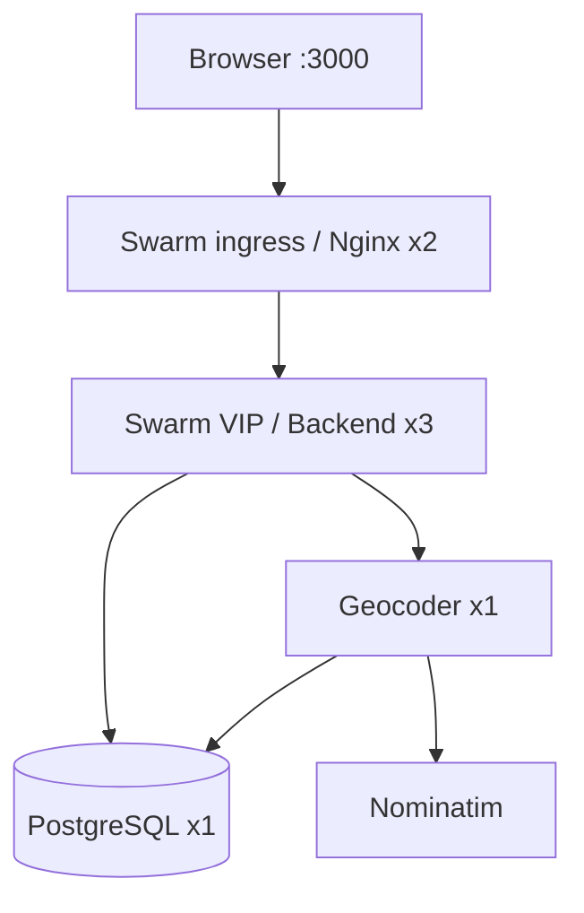

# Menjalankan Delivery Zone dengan Docker Swarm

Panduan utama memakai **Windows PowerShell + Docker Desktop, satu laptop**.
Swarm tetap memberikan replikasi dan load balancing pada satu Docker Engine.
Bagian akhir menjelaskan Linux dan beberapa server.

## 1. Siapkan Docker Desktop dan folder proyek

Jalankan Docker Desktop dengan Linux containers dan backend WSL 2. Untuk demo
dengan empat proses Java, sediakan sekitar 6 GB RAM bagi Docker/WSL bila tersedia.
Ekstrak ZIP, lalu masuk ke folder yang berisi `docker-stack.yml`:

```powershell
cd C:\Projects\delivery-zone
docker version
docker info --format "{{.OSType}}"
```

Sesuaikan path dengan hasil ekstrakmu. `docker version` harus menampilkan Client
dan Server; tipe OS harus `linux`. JDK, Maven, dan Node.js tidak perlu diinstal di
Windows untuk jalur Docker ini. Koneksi internet diperlukan untuk mengunduh image
dan dependency saat build, serta untuk pencarian alamat yang belum tersimpan.

Jika sebelumnya menjalankan versi Compose di folder ini, hentikan dahulu agar
port 3000 tidak bentrok:

```powershell
docker compose down
```

Perintah tersebut mempertahankan volume. Swarm memakai volume berbeda,
`deliveryzone_delivery_data`; data Compose lama tidak otomatis dipindahkan.

## 2. Build image aplikasi

Jalankan dari root proyek, berurutan:

```powershell
docker build -t delivery-zone-backend:swarm-v1 ./backend
docker build -t delivery-zone-frontend:swarm-v1 ./frontend
```

Build pertama memerlukan waktu untuk mengunduh dependency. Build backend
menjalankan tes Java; build frontend menjalankan tes, TypeScript, dan Vite.
Backend dan geocoder memakai image Java yang sama dengan profil berbeda.
`docker stack deploy` tidak melakukan build image dari source.

## 3. Aktifkan Swarm dan beri label node

```powershell
docker swarm init
docker node ls
```

Jika Docker menyatakan node sudah menjadi anggota Swarm, tidak perlu init ulang.
Jalankan perintah berikut dari node manager. Untuk jalur satu laptop, pastikan
daftar node hanya memuat satu manager dengan status `Ready` dan availability `Active`.

```powershell
$swarmNodeId = docker info --format "{{.Swarm.NodeID}}"
docker node update --label-add delivery_data=true --label-add delivery_geocoder=true $swarmNodeId
```

Label menempatkan PostgreSQL dan geocoder pada node yang ditentukan. Berikan
masing-masing label tersebut kepada **tepat satu node**. Data volume PostgreSQL
bersifat lokal ke node; geocoder memakai satu antrean outbound dalam satu proses.

## 4. Deploy stack

Opsional, identifikasikan aplikasimu kepada provider dengan nama dan kontak/repo
sungguhan, mengganti contoh berikut:

```powershell
$env:GEOCODING_USER_AGENT = "DeliveryZone/1.0 (https://github.com/USERNAME/delivery-zone)"
```

Gunakan nilai default jika hanya mencoba secara lokal dan belum punya repository.
Jika ada override, atur sebagai environment variable PowerShell. Contohnya port:

```powershell
# Opsional jika port 3000 sedang digunakan:
# $env:WEB_PORT = "3001"
```

`docker stack deploy` tidak otomatis membaca `.env`. Jalur Swarm menggunakan
environment terminal dan default di `docker-stack.yml`. Jangan mengandalkan
perubahan `.env` untuk deployment Swarm. Default database untuk demo adalah
user `delivery`, password `delivery_dev`, database `delivery_zone`.

```powershell
docker stack config -c docker-stack.yml
docker stack deploy --resolve-image never -c docker-stack.yml deliveryzone
docker stack services deliveryzone
```

`--resolve-image never` sesuai jalur satu node ini karena image aplikasi baru
dibangun pada Docker Engine yang sama. Untuk beberapa node, gunakan registry
seperti bagian 11. PostgreSQL tetap diunduh dari registry bila belum tersedia.

Tunggu sampai semua replika tersedia; startup awal dapat memerlukan beberapa menit:

| Service | REPLICAS yang diharapkan | Fungsi |
| --- | --- | --- |
| `deliveryzone_frontend` | `2/2` | React/Nginx, pintu masuk web |
| `deliveryzone_backend` | `3/3` | CRUD, jarak, zona, baca cache |
| `deliveryzone_geocoder` | `1/1` | Forward geocoding, cache miss, jeda provider |
| `deliveryzone_db` | `1/1` | Data pengiriman dan cache bersama |

Tidak ada `depends_on` pada stack. Aplikasi mencoba ulang koneksi Flyway saat
database belum siap; Swarm memiliki restart policy dan health check untuk layanan.

## 5. Buka aplikasi

Buka **http://localhost:3000**. Jika mengubah `WEB_PORT`, sesuaikan alamatnya.
Untuk memeriksa API dari PowerShell:

```powershell
Invoke-RestMethod http://localhost:3000/api/config
Invoke-RestMethod http://localhost:3000/api/deliveries
```

Buat pengiriman dengan alamat landmark publik, misalnya
`Monumen Nasional, Jakarta, Indonesia`. Detail akan menampilkan koordinat,
jarak, zona, sumber hasil, dan waktu pengambilan koordinat. Jika provider
menolak permintaan atau tidak bisa dijangkau, data tetap tersimpan dengan zona
`UNKNOWN`; gunakan tombol retry setelah layanan pulih.

Swarm hanya memublikasikan port frontend. API diakses melalui `/api` pada port
yang sama; port backend 8080 dan database 5432 tidak dibuka ke host oleh stack ini.

## 6. Buktikan load balancing

```powershell
1..12 | ForEach-Object {
    (Invoke-RestMethod http://localhost:3000/api/instance).instanceId
}
```

Hasil seharusnya menunjukkan beberapa nama task backend, misalnya
`deliveryzone_backend.1.…`, `.2.…`, dan `.3.…`. Urutan dan jumlah per task tidak
harus merata persis. Endpoint diberi `Cache-Control: no-store`; Nginx membuat
koneksi upstream baru agar distribusi ke backend mudah diamati. Ini tidak
memanggil Nominatim dan tidak mengubah data pengiriman.

Cocokkan dengan task yang berjalan:

```powershell
docker service ps deliveryzone_backend
```

Alurnya:



Ingress membagi koneksi masuk ke frontend. Nginx mengakses nama service `backend`
melalui DNS Docker, lalu VIP Swarm membagi koneksi ke replika backend. Swarm sudah
menyediakan load balancing tersebut; tidak perlu menambahkan Traefik untuk demo ini.

## 7. Tambah replika dan periksa cache

Jika memori mencukupi:

```powershell
docker service scale deliveryzone_backend=5
docker stack services deliveryzone
```

Ulangi pemeriksaan `/api/instance`. Kembalikan konfigurasi demo:

```powershell
docker service scale deliveryzone_backend=3
```

Perubahan `service scale` bersifat perubahan runtime. Deploy ulang file stack
mengembalikan jumlah replika ke nilai di file. Ubah `deploy.replicas` bila ingin
jumlah baru bertahan setelah deployment berikutnya.

Untuk memeriksa cache bersama, buat dua pengiriman dengan referensi berbeda dan
alamat sama. Setelah lookup pertama berhasil, pengiriman berikutnya menunjukkan
sumber `CACHE`, termasuk bila ditangani replika backend lain. Waktu koordinat
tetap waktu pengambilan aslinya.

Jangan menambah replika geocoder atau database. Satu geocoder mengoordinasikan
cache miss dan jeda minimal 1,1 detik setelah request provider sebelumnya selesai.
Backend profil `swarm` tidak memiliki adapter Nominatim aktif. Backend memeriksa
cache database langsung, lalu menghubungi geocoder hanya untuk alamat baru.

Uji kegagalan geocoder opsional:

```powershell
docker service scale deliveryzone_geocoder=0
```

Alamat yang sudah berhasil di-cache tetap bisa diselesaikan. Alamat baru akan
menjadi `UNKNOWN`, dengan waktu tunggu internal maksimal sekitar 20 detik per
lookup. Kembalikan layanan setelah percobaan:

```powershell
docker service scale deliveryzone_geocoder=1
```

Permintaan yang timeout dapat tetap diselesaikan worker dan mengisi cache untuk
retry berikutnya. Cache tidak berlaku sebagai antrean pekerjaan atau jaminan
semua lookup selesai dalam 20 detik; banyak alamat baru bersamaan tetap antre.

## 8. Diagnosis jika belum jalan

```powershell
docker stack services deliveryzone
docker stack ps deliveryzone --no-trunc
docker service logs --tail 100 deliveryzone_backend
docker service logs --tail 100 deliveryzone_geocoder
docker service logs --tail 100 deliveryzone_db
docker service logs --tail 100 deliveryzone_frontend
```

| Gejala | Langkah |
| --- | --- |
| Docker Server tidak tersambung | Jalankan Docker Desktop dan tunggu Engine siap; gunakan Linux containers |
| `This node is not a swarm manager` | Jalankan command administrasi pada manager |
| `no suitable node` | Periksa label pada langkah 3 dan RAM node; geocoder/database hanya boleh ditempatkan satu kali per node |
| `No such image` atau pull denied | Build kedua image pada Engine yang dipakai; cluster beberapa node harus memakai registry |
| Port 3000 dipakai | Hentikan Compose lama atau atur `WEB_PORT`, kemudian deploy ulang |
| Replika restart / exit 137 | Periksa log dan alokasi RAM Docker/WSL; kurangi jumlah backend bila perlu |
| HTTP 502 saat startup | Tunggu backend/database sehat, lalu lihat log backend |
| `UNKNOWN` tetapi form berhasil disimpan | Periksa koneksi internet dan log geocoder; ini perilaku fallback ketika lookup gagal |
| Hanya satu ID terlihat | Pastikan backend `3/3`, ulangi request, dan periksa bahwa image frontend terbaru dipakai |

Mengubah `DB_PASSWORD` pada database yang sudah berisi data tidak mengganti password
role PostgreSQL secara otomatis. Pertahankan kredensial saat memakai volume lama
atau ubah role database dengan prosedur administrasi PostgreSQL yang sesuai.

## 9. Update dan berhenti

Untuk perubahan source, gunakan tag baru agar Swarm mengenali versi image baru:

```powershell
docker build -t delivery-zone-backend:swarm-v2 ./backend
docker build -t delivery-zone-frontend:swarm-v2 ./frontend
$env:BACKEND_IMAGE = "delivery-zone-backend:swarm-v2"
$env:FRONTEND_IMAGE = "delivery-zone-frontend:swarm-v2"
docker stack deploy --resolve-image never -c docker-stack.yml deliveryzone
```

Lakukan hal yang sama dengan tag versi berikutnya pada update selanjutnya.
Backend/frontend diperbarui satu per satu dengan `start-first`. Geocoder memakai
`stop-first` sehingga update normal tidak menjalankan dua antrean provider sekaligus.

Berhenti tanpa menghapus data:

```powershell
docker stack rm deliveryzone
```

Tunggu task/network lama terhapus sebelum deploy ulang. Volume database tetap
ada. Jalankan deployment dengan nama stack `deliveryzone` yang sama untuk memakai
volume tersebut kembali. Tidak perlu menjalankan `docker swarm leave` untuk
menghentikan aplikasi ini.

## 10. Ringkasan satu node Linux / Bash

Docker Engine harus sudah berjalan dan user terminal punya akses Docker:

```bash
cd /path/to/delivery-zone
docker build -t delivery-zone-backend:swarm-v1 ./backend
docker build -t delivery-zone-frontend:swarm-v1 ./frontend
docker swarm init
swarm_node_id=$(docker info --format '{{.Swarm.NodeID}}')
docker node update --label-add delivery_data=true --label-add delivery_geocoder=true "$swarm_node_id"
docker stack deploy --resolve-image never -c docker-stack.yml deliveryzone
docker stack services deliveryzone
for request_number in $(seq 1 12); do
  curl -s http://localhost:3000/api/instance
  echo
done
```

Lewati `swarm init` jika sudah aktif. Override Bash memakai `export`, misalnya
`export WEB_PORT=3001`, sebelum deploy.

## 11. Beberapa server Linux

Gunakan jaringan privat antar-node. Pada manager:

```bash
docker swarm init --advertise-addr MANAGER_PRIVATE_IP
docker swarm join-token worker
```

Jalankan command `docker swarm join ...` yang dicetak Docker pada setiap worker.
Kemudian dari manager, lihat `docker node ls` dan beri label `delivery_data=true`
dan `delivery_geocoder=true` pada tepat satu node yang dipilih. Kedua label boleh
berada pada node yang sama. Jangan duplikasi label geocoder untuk failover otomatis.

Image lokal di manager tidak otomatis disalin ke worker. Build, tag, dan push
image ke registry milikmu yang dapat diakses semua node:

```bash
docker login REGISTRY_HOST
docker build -t REGISTRY_HOST/NAMESPACE/delivery-zone-backend:swarm-v1 ./backend
docker build -t REGISTRY_HOST/NAMESPACE/delivery-zone-frontend:swarm-v1 ./frontend
docker push REGISTRY_HOST/NAMESPACE/delivery-zone-backend:swarm-v1
docker push REGISTRY_HOST/NAMESPACE/delivery-zone-frontend:swarm-v1
export BACKEND_IMAGE=REGISTRY_HOST/NAMESPACE/delivery-zone-backend:swarm-v1
export FRONTEND_IMAGE=REGISTRY_HOST/NAMESPACE/delivery-zone-frontend:swarm-v1
docker stack deploy --with-registry-auth -c docker-stack.yml deliveryzone
```

Ganti `REGISTRY_HOST/NAMESPACE` dengan registry dan namespace sebenarnya.
Untuk jalur ini, biarkan Docker melakukan resolusi image registry; jangan gunakan
opsi `--resolve-image never` dari tutorial satu node. Akses web melalui
`http://IP_NODE:3000`; routing mesh dapat meneruskan koneksi meski node tersebut
tidak memiliki task frontend lokal.

Untuk komunikasi cluster, Docker memerlukan TCP 2377, TCP/UDP 7946, dan UDP 4789
di jaringan antar-node sesuai perannya. Batasi port cluster pada jaringan tepercaya.
Port aplikasi 3000 perlu dapat diakses perangkat yang membuka web.

## Batas desain dan hasil verifikasi

Konfigurasi ini memberikan replikasi aplikasi dan load balancing. Satu laptop
tetap satu titik kegagalan. PostgreSQL memakai satu volume lokal dan geocoder
dipatok pada satu node; keduanya belum high availability. Jika node database
mati, CRUD tidak tersedia. Jika hanya geocoder mati, cache yang sudah tersimpan
tetap tersedia selama database sehat. Migrasi geocoder ke node lain perlu
memastikan proses lama sudah berhenti agar tidak ada dua worker aktif.

Stack memublikasikan port web melalui ingress ke antarmuka node; berbeda dengan
binding localhost pada Compose demo. Aplikasi belum memiliki login atau TLS,
jadi gunakan untuk demo lokal/jaringan tepercaya. Deployment internet memerlukan
konfigurasi akses dan HTTPS tersendiri.

Tes backend memeriksa dua client independen lewat HTTP ke geocoder bersama,
cache persisten H2, fallback worker, serta pemisahan profil. Docker CLI berhasil
memvalidasi file stack. Docker Engine tidak dapat diakses di lingkungan pengerjaan;
image/container dan distribusi trafik Swarm belum dijalankan di sana. Langkah 4–7
menjadi verifikasi runtime di laptop/servermu. Detail ada di `VERIFICATION.md`.
